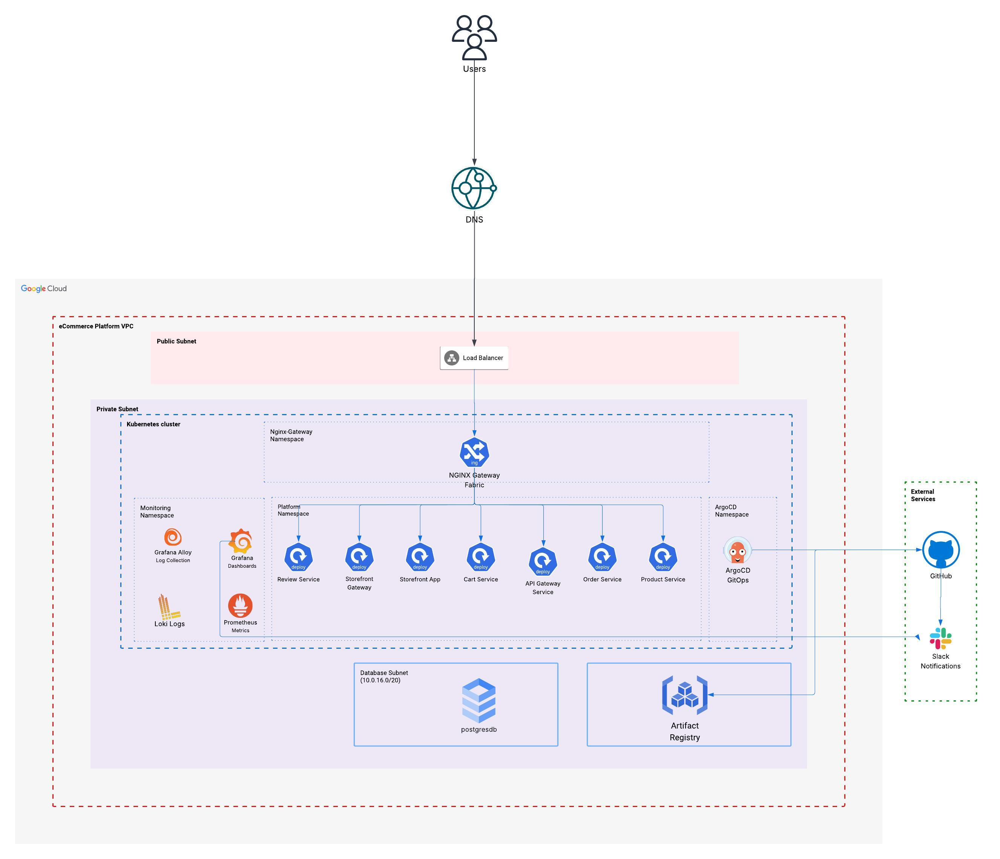

# GKE Infrastructure for an eCommerce Platform



Production-ready, **fully reusable** Google Kubernetes Engine (GKE) platform with GitOps, monitoring, and secrets management for an eCommerce application.


## 🎯 Key Features

✅ **Fully Reusable** - Deploy across any GCP project, domain, or organization  
✅ **Variable-Based** - Zero hardcoded values, 100% configurable  
✅ **Secure by Default** - Private cluster, encrypted etcd, no public IPs  
✅ **Production-Ready** - HA PostgreSQL, monitoring, GitOps, secrets management  
✅ **Well Organized** - 6-layer architecture, clear dependency flow  

## 🚀 Quick Start

```bash
# 1. Configure (edit 4 required values)
cp terraform.tfvars.example terraform.tfvars

# 2. Deploy
terraform init
terraform apply
```

**Required variables**: `project_id`, `domain_name`, `github_org`, `storage_sa_email`  
**Auto-generates**: All FQDNs, DNS records, TLS routes, monitoring dashboards

## 🏗️ Infrastructure Architecture

Production-ready GKE platform organized in **6 logical layers** following dependency order:

### Layer 1: Foundation
- **VPC Network** - Custom VPC with segregated subnets (Kubernetes, Database)
- **Cloud NAT** - Secure egress for private resources
- **Private Service Connection** - VPC peering for managed services

### Layer 2: Core Infrastructure
- **GKE Cluster** - Private cluster with etcd encryption (Cloud KMS, 90-day rotation)
- **PostgreSQL** - Regional HA database, private IP only, automated backups
- **Private DNS** - Internal DNS for service discovery
- **Cloud Storage** - Centralized storage for backups and artifacts

### Layer 3: Platform Services
- **ArgoCD** - GitOps continuous delivery
- **NGINX Gateway** - Gateway API ingress controller
- **HashiCorp Vault** - Secrets management with GCP KMS auto-unseal
- **External Secrets Operator** - Kubernetes secrets from Vault

### Layer 4: Applications
- **Platform Apps** - GitOps-managed applications via ArgoCD App of Apps pattern

### Layer 5: Observability
- **Prometheus Stack** - Metrics collection and alerting (Prometheus, Grafana, AlertManager)
- **Loki Stack** - Log aggregation and querying
- **Grafana Alloy** - Unified metrics and logs collection
- **Golden Signals Alerts** - Latency, errors, saturation, traffic monitoring
- **PostgreSQL Monitoring** - Database performance and slow query tracking

### Layer 6: Ingress
- **Gateway API** - HTTP/HTTPS routes with TLS termination for:
  - ArgoCD (`argocd.yourdomain.com`)
  - Grafana (`monitoring.yourdomain.com`)
  - Prometheus (`prometheus.yourdomain.com`)
  - Vault (`vault.yourdomain.com`)

### 🔒 Security Features
- 🔐 **Private by default** - Cluster API and nodes fully private
- 🔐 **Encrypted etcd** - Cloud KMS with automatic key rotation
- 🔐 **Workload Identity** - Pod-level GCP authentication
- 🔐 **Binary Authorization** - Signed container images only
- 🔐 **Network Policies** - Pod-level network segmentation
- 🔐 **No public IPs** - Database and cluster fully private

### 📊 High Availability
- ✅ Multi-zone GKE cluster
- ✅ Regional PostgreSQL with automatic failover
- ✅ Replicated monitoring stack (2+ replicas)
- ✅ Cross-region backups

📖 **Detailed module documentation**: See individual `modules/*/README.md` files

## Prerequisites

- Google Cloud Project with billing enabled
- `gcloud` CLI authenticated
- Terraform >= 1.9.8
- GitHub repository with Actions enabled

## Local Development

### Authentication

Authenticate with your Google account for local development:

```powershell
gcloud auth application-default login --project=<your-project-id>
```

### Enable Required APIs

The following APIs must be enabled in your GCP project:

```powershell
gcloud services enable compute.googleapis.com \
  container.googleapis.com \
  servicenetworking.googleapis.com \
  cloudresourcemanager.googleapis.com \
  cloudkms.googleapis.com \
  iam.googleapis.com \
  --project=<your-project-id>
```

**Note**: Cloud KMS API is required for etcd encryption (enabled by default)

### Usage

```powershell
# Initialize Terraform
terraform init

# Plan changes
terraform plan

# Apply changes
terraform apply
```

## Accessing Private Infrastructure

Since both the GKE cluster and database are fully private (no public access), you need to use one of these methods:

### Recommended: Identity-Aware Proxy (IAP)

**Simplest and most secure** - No VPN required, uses Google's IAP:

```powershell
# Connect to cluster
gcloud container clusters get-credentials k8s-platform `
  --region europe-west1 `
  --project random-project-471611-k0 `
  --internal-ip

# Access via IAP tunnel
gcloud compute start-iap-tunnel <instance-name> 22 \
  --local-host-port=localhost:2222 \
  --zone=europe-west1-b
```

**Benefits:**
- ✅ No additional infrastructure cost
- ✅ Integrated with Google Cloud IAM
- ✅ No VPN client installation needed
- ✅ Automatic audit logging
- [Custom Domain Setup](docs/VPN_CUSTOM_DOMAIN_SETUP.md) - General domain setup guide
- [Reverse Proxy Explained](docs/REVERSE_PROXY_EXPLAINED.md) - Nginx configuration details

### Other Access Methods

- **Cloud Shell**: Instant access, no setup required, built-in kubectl
- **Manual DNS**: Set `cloudflare_zone_id = ""` to skip Cloudflare automation
- **Cloud VPN**: Site-to-site VPN for enterprise (more expensive)
- **GitHub Actions**: CI/CD already configured with Workload Identity

📖 **Full access guide**: [docs/PRIVATE_CLUSTER_ACCESS.md](docs/PRIVATE_CLUSTER_ACCESS.md)

## CI/CD Workflow

### Pull Request Workflow (`terraform-ci.yml`)
- Triggers on: Pull requests to `main` with Terraform file changes
- Actions:
  - Runs `terraform fmt` check
  - Runs `terraform validate`
  - Generates `terraform plan`
  - Posts plan results as PR comment

### Production Deployment (`terraform-prod.yaml`)
- Triggers on: Push to `main` or manual workflow dispatch
- Actions:
  - Runs `terraform plan`
  - **Automatically applies changes** if plan shows modifications
  - Uses GitHub Environment protection (`production`)
  - Uploads plan artifacts for audit trail

## Configuration

Copy `terraform.tfvars.example` to `terraform.tfvars` and customize:

```hcl
project_id   = "your-gcp-project-id"
region       = "europe-west1"
network_name = "k8s-platform-vpc"
```

> **Note:** `terraform.tfvars` is generated automatically in CI/CD from GitHub Secrets and Variables.

## GitHub Actions Setup

### Required Secrets
- `WIF_PROVIDER` - Workload Identity Provider resource name
- `SA_EMAIL` - Service account email for GitHub Actions
- `GKE_PROJECT` - GCP project ID

### Required Variables
- `GKE_REGION` - GCP region (default: `europe-west1`)

See [docs/TERRAFORM_CI_WIF_SETUP.md](docs/TERRAFORM_CI_WIF_SETUP.md) for detailed setup instructions.

## 📖 Documentation

### Essential Guides
- **[DEPLOYMENT_CHECKLIST.md](docs/DEPLOYMENT_CHECKLIST.md)** - Pre-deployment setup and requirements
- **[CONFIGURATION_GUIDE.md](docs/CONFIGURATION_GUIDE.md)** - How to configure for your environment
- **[COMPLETION_SUMMARY.md](COMPLETION_SUMMARY.md)** - Refactoring changes and current status

### Additional Resources
- **[terraform.tfvars.example](terraform.tfvars.example)** - Configuration template
- **[CI/CD Setup](docs/TERRAFORM_CI_WIF_SETUP.md)** - GitHub Actions with Workload Identity
- **[Module Documentation](modules/)** - Individual module READMEs

## Repository Structure

```
.
├── main.tf                        # Infrastructure organized in 6 logical layers
├── variables.tf                   # All configurable parameters
├── outputs.tf                     # Service endpoints and resource outputs
├── terraform.tfvars.example       # Configuration template
├── modules/
│   ├── network/                   # VPC, subnets, NAT, firewall rules
│   ├── cluster/                   # GKE cluster with etcd encryption
│   ├── database/                  # PostgreSQL (HA, private IP only)
│   ├── dns/                       # Private DNS zone for internal services
│   ├── storage/                   # Cloud Storage buckets
│   ├── helm/                      # ArgoCD + NGINX Gateway deployments
│   ├── vault-config/              # Vault Kubernetes auth configuration
│   ├── external-secrets/          # External Secrets Operator setup
│   ├── argocd-applications/       # ArgoCD App of Apps
│   ├── argocd-helm-app/           # Reusable ArgoCD application module
│   ├── prometheus-stack/          # Prometheus + Grafana monitoring
│   ├── loki-stack/                # Log aggregation
│   ├── grafana-alloy/             # Metrics/logs collector
│   ├── grafana-alerting/          # Golden Signals alerts
│   ├── postgres-monitoring/       # PostgreSQL exporter + dashboards
│   └── gateway-api/               # Gateway API + HTTPRoutes
├── argocd-apps/                   # ArgoCD Application manifests
├── manifests/                     # Kubernetes resources (Gateway, certs, etc.)
├── docs/
│   ├── DEPLOYMENT_CHECKLIST.md    # 👈 START HERE
│   ├── CONFIGURATION_GUIDE.md     # Configuration examples
│   ├── MAIN_TF_REFACTORING.md     # Architecture explanation
│   └── [30+ other guides]
└── .github/
    └── workflows/                 # Terraform CI/CD pipelines
```

## 🔄 Reusability

This infrastructure is designed to be **completely reusable**:

### Deploy for Different Organization
```hcl
# terraform.tfvars
project_id   = "acme-prod-123"
domain_name  = "acme.com"
github_org   = "acme-corp"

# Auto-generates:
# - https://argocd.acme.com
# - https://monitoring.acme.com
# - https://vault.acme.com
```

### Multi-Environment Setup
```bash
# Development
cp terraform.tfvars.example environments/dev/terraform.tfvars
# Edit: domain_name = "dev.yourdomain.com"

# Staging
cp terraform.tfvars.example environments/staging/terraform.tfvars
# Edit: domain_name = "staging.yourdomain.com"

# Production
cp terraform.tfvars.example environments/prod/terraform.tfvars
# Edit: domain_name = "yourdomain.com"
```

See [CONFIGURATION_GUIDE.md](docs/CONFIGURATION_GUIDE.md) for more examples.

## Security

- Uses Workload Identity Federation (no service account keys)
- Private Google Access enabled on all subnets
- VPC Flow Logs for audit and troubleshooting
- Cloud NAT for controlled egress
- GitHub Environment protection for production deployments

## Contributing

1. Create a feature branch
2. Make changes
3. Open a pull request (triggers Terraform plan)
4. Review plan output in PR comments
5. Merge to `main` (triggers automatic apply)

## License

MIT

## Maintainer

**Rotimi Abiola** ([@rotimiAbiola](https://github.com/rotimiAbiola))
